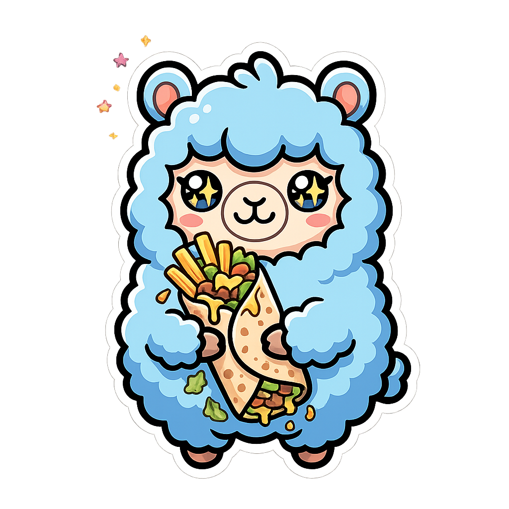

  

<h3 class="cool-title">
  <em>AI & DevOps Developer | LLMs • RAG • Machine Learning</em>
</h3>

  
  
  
  
  
  

  
  
  
  
  
  
  
  

  

---

## ⚙️ Languages & Tools

<table align="center" width="100%" cellspacing="0" cellpadding="0">
  <tr>
    <!-- AI / Python Core -->
    <td align="center" width="10%"></td>
    <td align="center" width="10%"></td>
    <td align="center" width="10%"></td>
    <td align="center" width="10%"></td>
    <td align="center" width="10%"></td>
    <td align="center" width="10%"></td>
    <td align="center" width="10%"></td>
    <td align="center" width="10%"></td>
    <td align="center" width="10%"></td>
    <td align="center" width="10%"></td>
  </tr>

  <tr>
    <!-- Tools / Platforms -->
    <td align="center" width="10%"></td>
    <td align="center" width="10%"></td>
    <td align="center" width="10%"></td>
    <td align="center" width="10%"></td>
    <td align="center" width="10%"></td>
    <td align="center" width="10%"></td>
    <td align="center" width="10%"></td>
    <td align="center" width="10%"></td>
    <td align="center" width="10%"></td>
    <td align="center" width="10%"></td>
  </tr>

  <tr>
    <!-- Databases / Infra -->
    <td align="center" width="10%"></td>
    <td align="center" width="10%"></td>
    <td align="center" width="10%"></td>
    <td align="center" width="10%"></td>
    <td align="center" width="10%"></td>
    <td align="center" width="10%"></td>
    <td align="center" width="10%"></td>
    <td align="center" width="10%"></td>
    <td align="center" width="10%"></td>
    <td align="center" width="10%"></td>
  </tr>
</table>

---

## 📈 Contribution Graph

---

## 🌍 Languages

<table>
  <thead>
    <tr>
      <th>🌐 Language</th>
      <th>🎯 Level</th>
      <th>📊 Proficiency</th>
    </tr>
  </thead>
  <tbody>
    <tr>
      <td align="center"> &nbsp; <b>Arabic</b></td>
      <td align="center">🥇 Native</td>
      <td align="left">▓▓▓▓▓▓▓▓▓▓ 100%</td>
    </tr>
    <tr>
      <td align="center"> &nbsp; <b>French</b></td>
      <td align="center">⭐ Fluent</td>
      <td align="left">▓▓▓▓▓▓▓▓▓░ 90%</td>
    </tr>
    <tr>
      <td align="center"> &nbsp; <b>English</b></td>
      <td align="center">💼 Professional</td>
      <td align="left">▓▓▓▓▓▓▓▓░░ 80%</td>
    </tr>
  </tbody>
</table>

---

## ☕ How to Reach Me

 

  

