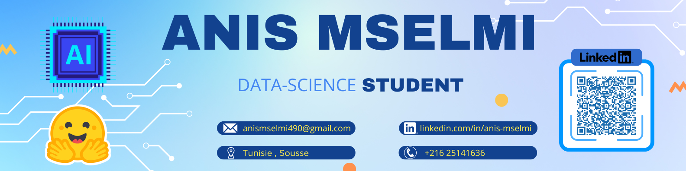
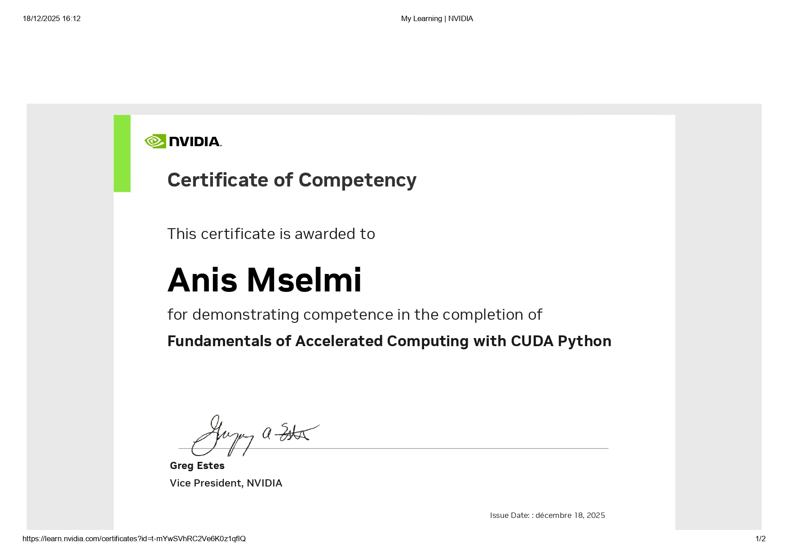

  

  
  

  
  
  
  

  
  
  
  

  

## 🎓 Computer Engineering Student | 🤖 AI & ML Enthusiast | 💻 Software and AI Student

  
  
  

  

---

# 🚀 **What I'm Up To**

## 🤖 Mastering Machine Learning & Deep Learning and 💻 Building Applications with Python and Web Tools are core to my work. I focus on 🧩 Applying AI in Real-World Solutions, turning theoretical models into practical applications. I am currently 🔍 Open to Internships & Part-Time AI Projects to further expand my experience.

---

## 📫 **How to Reach Me**

 
&nbsp;&nbsp;

&nbsp;&nbsp;

  

---

## ⚙️ Languages & Tools  

  
  
    
  
  
    
    
    
    
    
    
    
    
  
  
   
    

---

## 📗 NVIDIA Certificates

<table>
  <tr>
    <td align="center"></td>
    <td align="center"></td>
    <td align="center"></td>
  </tr>
  <tr>
    <td align="center"></td>
    <td align="center"></td>
    <td align="center"></td>
  </tr>
  <tr>
    <td align="center"></td>
    <td align="center">
      
    </td>
    <td align="center"></td>
  </tr>
</table>

---
 
 ## 📊 GitHub Profile Stats 

<samp>
 

  

 
</samp>

---

## 🌍 Languages I Speak
| Choose your language | Flags |
|---------------------|-------|
| English |  |
| French  |  |
| Arabic  |  |
---

## ☕ Support Me

  

